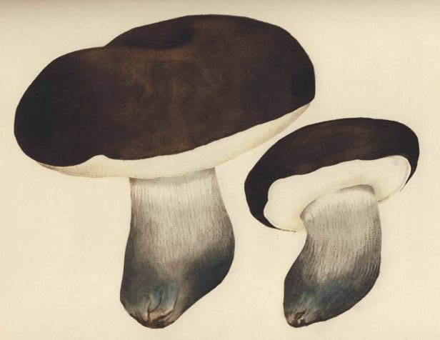

# E-book: Mushrooms, Russia and History by V. P. Wasson & R. G. Wasson

This repository contains a work in progress e-book edition of Valentina Pavlovna Wasson and R. Gordon Wasson's pioneering two volume work *Mushrooms, Russia and History*. As only 512 copies were ever published, it is my hope that this e-book edition will make this fascinating work more accessible to the general public. 

## Notes on the E-book edition

This e-book edition was compiled and typeset by Bayard Randel <kit@nocturne.net.nz> . It was derived from the [New Alexandria Archive](http://www.newalexandria.org/archive/) digital edition pdf, which was scanned from the original copy no. 37, and hand corrected by Igor Dolgov, Zachary Jones, and Greg Golden.

## Make tasks
### Build
To build e-books run:

    make

#### Epub only

    make epub

#### Mobi only

    make mobi

*Note*: Building mobi/all requires [Kindlegen](http://www.amazon.com/gp/feature.html?docId=1000765211) on your path.

### Verify
To verify the epub, run:

    make check

*Note*: This requires [epubcheck](https://github.com/idpf/epubcheck) on your path.

## Current Progress

### Completed

* Chapter layout
* Some frontmatter
* Preface
* Chapter I-II
* Chapter V, Book 1, 7

### Todo

* List of Plates/Illustrations need links
* Chapters III onwards
* Index

## Contributing

Please feel free to contact me with corrections. If you have access to the original texts, please see a list of errors that I need assistance with in [errors.md](errors.md). If you are in possession of an original edition of *Mushrooms, Russia and History*, I would be very grateful to hear from you and any assistance you could provide to ensure this e-book edition is as accurate as possible.

## Changes from the original text

In order to adapt this work to e-book formats, a number of changes have been made:

* While Mushrooms, Russia and History was originally published in two volumes, both volumes are presented here as a single e-book for convenience. References to volumes in the text have been removed.
* As e-book page layouts are fluid and device dependant, the position of figures and plates have been changed to improve clarity.
* Footnotes are rendered at the end of chapters and numbered per chapter rather than per page.
* References to page numbers from the original text have been removed. Links instead are provided from appendicies and indicies.

## Changes from the New Alexandria Archive digital edition pdf

Where possible I have endeavoured to edit and correct errors in the text which presumably resulted from errors in OCR. Unfortunately I do not possess, nor know of an original copy of *Mushrooms, Russia and History* available for reference in New Zealand to ensure the absolute parity of this edition with the original text.
